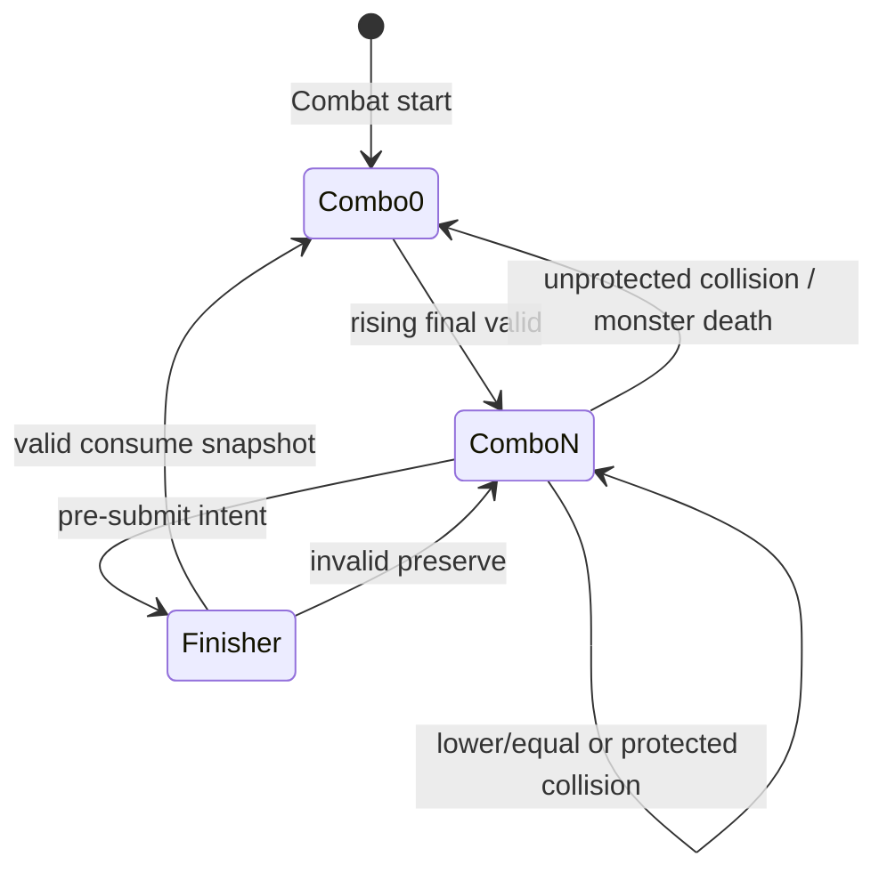
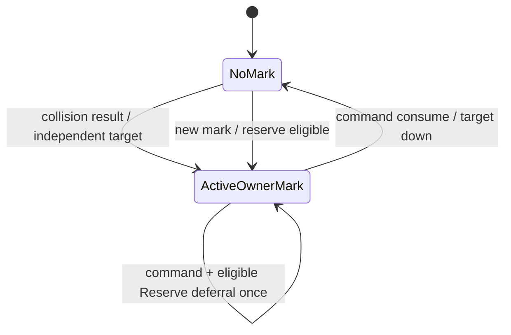
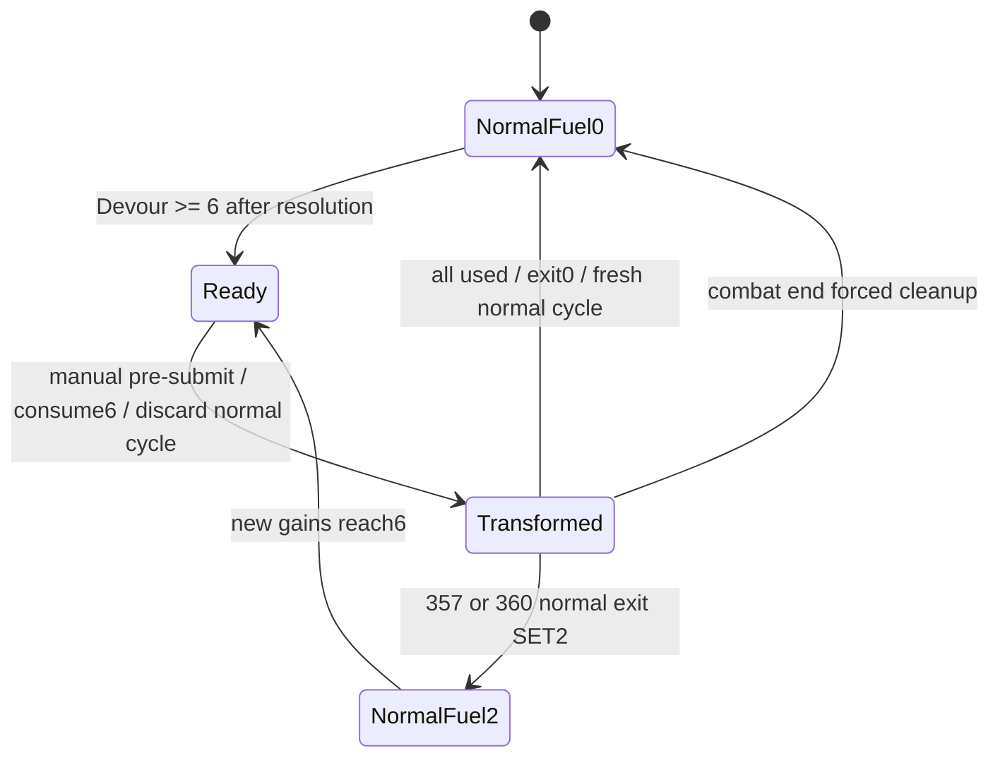
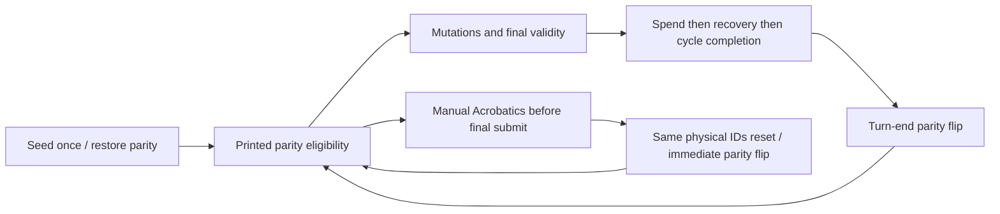

# PVE CONTENT-005Q-DESIGN-D CLOSEOUT

120/120 runtime-ready **설계 계약**. 실행 구현이나 production 배포가 아니다.

## Source methodology

사용자 확정 D01~D07 및 CLOSEOUT clarification > 이전 사용자 결정 >005Q >005R > BETA v0.1 > canonical class > existing runtime(reference only). 원본 행·stable ID·BETA 숫자·기존 DESIGN-B/C는 변경하지 않았다. 새로운 조건/수치/순서는 BETA_V02_INFERRED이며 source-explicit으로 위장하지 않는다. 전체 계약의 `provenance.fieldOrigins`와 `sourceValueV01`에서 구분한다.

## 63개 CLOSEOUT 항목

1. **branch / PR** — `feat/pve-content-005q-design-d` · [Draft PR #24](https://github.com/pagter54-creator/dungeon-bluff/pull/24). Draft/open을 유지한다.

2. **baseline HEAD** — `f108b5b2d9715df057b7a38f949fa2a9b23e107d` (accepted 005C-FINAL).

3. **final HEAD** — 최종 문서 커밋의 정확한 SHA와 Project Checks 결과는 PR #24의 CLOSEOUT 검증 기록에 기록한다. 문서에 자신의 커밋 SHA를 기록해 재커밋하는 순환을 만들지 않는다.

4. **changed files** — 본 PR의 신규/변경 대상: PREFLIGHT.json(이전 단계), USER_CONFIRMED.json, DESIGN_D.json, DESIGN_D.md, DESIGN_D_AUDIT.json, 새 validator와 test. 최종 비교에서 기존 baseline 파일은 변경하지 않는다.

5. **target IDs** — aug-271~390.

6. **unique coverage** — 120 unique IDs; duplicates0.

7. **SPEC_COMPLETE** — 120.

8. **SPEC_PARTIAL** — 0.

9. **SPEC_AMBIGUOUS** — 0.

10. **RUNTIME_READY** — 120개의 구현 가능한 설계 계약. 실행 구현 완료와 구분한다.

11. **RUNTIME_BLOCKED** — 0.

12. **Martial** — 30/30.

13. **Vampire** — 30/30.

14. **Ghost** — 30/30.

15. **Twins** — 30/30.

16. **archetypes** — 12개 × 10장. 아래 전체 카드 표에 각 계통을 표시한다.

17. **stage distribution** — 각 직업 Stage1/2/3/4 = 3/9/9/9; 총 12/36/36/36.

18. **D01** — aug-287: 첫 파쇄3 적을 기억하고 무투가 본인의 다음 첫 primary root attack만 예약. 전투당1회; 다른 아군 보호 없음. 파쇄를 만든 이미 확정된 공격을 소급 변경하지 않는다. 예약 공격은 중복이 없어도 소비; 다른 invalid reason은 통과시키지 않는다. owner/card선택은 CLOSEOUT 사용자 확정, 다음-root/예약 소비 순서는 BETA_V02_INFERRED.

19. **D02** — Vampire별 ownerVampireId 표식, max1. 같은 대상 다중 소유 허용. 자신 제외, 최고 player.score 후보, 동점 seat→playerId. 소유자만 소비/유지.

20. **D03** — 기본8 threshold, 모든 remainder 이월. 한 atomic gain의 여러 threshold 각각 레벨+1/rearm. RUN 유지; retry 중복 없음.

21. **D04** — 선택/제출에서 printed/base physical number parity 확인. server reject가 숫자 변환보다 먼저. 복구는 same cardInstanceId.

22. **D05** — numeric cooldown·독립 cycle 명령 제한 없음.303 양측 VALID reserve1, cycle당1회 획득, 이후 새 mark 소비1회 유예.308 command사용+1 Dominance cap4 비소모; 이후 별도 valid primary attack stream ADD currentstacks. 최초4 reserve1/combat, sharedcap1/overflowdiscard.

23. **D06** — 307 실제 command 교환 ownercard collision만 통과, 다른 멤버 무효 유지, once/combat. HP 감소 효과 없음.

24. **D07** — 351 SELECTION_OPEN에서 owner 수동 활성화, submit 후 금지.6소비→일반 cycle 폐기→전용 pool→새cycle.358>355>351. 종료 새 일반 cycle, 전투 종료fuel0.

25. **Martial base canonical** — pool1/2/3/4/5. FINAL 비교, 첫 제출 gain0; 상승 valid +1 후 comboADD. 같은/낮은 valid 유지, noncollisioninvalid 유지, 모두 previous FINAL 갱신. collision/monsterdeath combo0, Combat중 collision-invalid score−1. Cycle reset은 combo/previous를 유지. 보호 우선순위299→291→280→276→base; 죽은enemy/CombatEnd는 무조건 reset.

26. **Vampire base canonical** — pool1/2/3/4/5. INPUT→SELF_MODIFY→seat-ordered numeric SWAP→Imp STEAL→FINAL. physical ID/소유/소비 zone 불변. collision finalvalidity 확정 후 mark 누락owner당 최대1 생성; pre-action score snapshot. Blood4→HEAL1, max6(324/328max8),328normalcost3; fullHP 무소비.

27. **Ghost base canonical** — pool1/2/3/4/4. normalvalid+1, Eventvalid+1, killvalid 총4, jointtop 총8(기본1 포함), Boss동일. postdamage/kill합산 뒤 threshold→level→rearm→remainder. SlashADD prelevel+1; valid만 소비, invalid 유지, cycle/levelup rearm.351build는 Slash/threshold변환을 귀화fuel모델로 대체.

28. **Twins base canonical** — pool1/2/3/4. 첫 Combat선택창 seeded RNG1회, reconnect 재추첨 없음. printed eligibility, turnendflip, 합법카드 부족시 turnstart deterministicflip. 곡예 sameID poolreset/즉시flip; 기본 새cycle완주 recharge,381valid3/385valid2로 대체.

29. **combo state machine** — 아래 다이어그램 및 machine baseCanonicals.martial_artist 참조.

30. **Thrall/Blood Command state machine** — 아래 다이어그램 및 baseCanonicals.vampire 참조.

31. **Devour/Slash state machine** — 아래 다이어그램 및 baseCanonicals.demon_swordsman 참조.

32. **Transformation state machine** — 아래 다이어그램; D03 RUN carry보다 D07 build의 combat-end reset0 우선.

33. **Parity/Acrobatics state machine** — 아래 다이어그램; selection eligibility와 FINAL parity-dependent Celestial 이동을 구분.

34. **room applicability** — 모든120개의 COMBAT/EVENT/REWARD/SHOP/REST boolean 확정.301 number-swap만 Event/Reward 허용, Dominance/damage/Reserve Combat만. 나머지119 Combat만. Ghost Event +1과 Twins Event/Reward 입력 parity는 base규칙이며 이 카드들의 damage/charge를 확장하지 않는다.

35. **once/reset/persistence** — 모든120 enum확정. onceGuard의 TURN/CYCLE 만료와 effectState COMBAT/RUN 만료를 별도로 기록. augmentationownership RUN은 별개. Devour/level/hunger RUN;351fuel Combat예외.

36. **visibility** — Public combo/Thrall/Blood/Devour/Slash/parity/readiness; owner만 Reserve/charges/physicalzones/skillintent; dedup/sequence SERVER_ONLY. 각 contract visibility 3개 enum과 resources reference 포함.

37. **reconnect** — authoritative resource/markowner-target/poolID/pendingreceipt/onceflags 복원. init·reroll·regrant·reconsume·historical-total재계산 금지.

38. **idempotency** — runId+rootActionId+sourceAugmentId+ownerPlayerId+effectInstanceId. 적/회복receipt/activation/threshold 서브키. atomic journal과 상태를 같이 기록.

39. **damage taxonomy** — ADD 또는 EXTRA_DAMAGE_COMPONENT; root부착 component는 별도 제출/충돌/validity/hit/retrigger 없음. 실제 피해 NOT_APPLICABLE 금지; defense/resource-only card는 N/A.

40. **defense taxonomy** — 281 MARK 공급ledger;283 SHRED threshold2면 computeddefense−1(최소0), marker 감소시 해제;296 PENETRATION1 한 eligiblefinisher/combat. 두 카드의 잘못된 incoming mitigation 의미 폐기.

41. **heal taxonomy** — 321/329/Sun/367 HEAL,327 PRE_DOWN_HEAL. 실제 HP증가로 receipt 생성, 과회복 clamp.327 HP1 livingotherally만; lethal0/이미 DOWNED revive 금지.

42. **recovery taxonomy** — SPENT→REMAINING, eligibility filter후 random stable-seed 또는390 mostrecent spentSequence. sameinstance=true. spend후/cycleadvance전. recovery는 공격/충전/ON_VALID 아님.

43. **base-rule overrides** — cap MAXpriority, finisher coefficient replace, commandmarkavailability, hungerthreshold,351pool/skill,371damagebase,381recharge. Override는 합산하지 않는다.

44. **cross-class matrix** — 아래12개 조합 및 machine crossClassMatrix.

45. **legacy runtime comparison** — 120개 전수 분류, 아래 hotspots 표. MATCH는 해당 legacy core만; 새 executable활성화 없음.

46. **primitive inventory** — ALREADY_EXISTS/NEEDS_EXTENSION/NEW_PRIMITIVE로 분류. machine primitiveInventory에 evidence path와 필요 변경을 기록.

47. **dependency graph** — 공통 guard/physicalidentity→Martialcombo/shatter→Vampiremark/swap/reserve/Blood; GhostDevour/Slash→transformation; Twinsparity/recovery→Celestial/Acrobatics→cross-class.

48. **runtime batches** — 005D-A271~300,005D-B301~330,005D-C331~360,005D-D361~390,005D-FINAL. 이 PR은 batch 구현을 시작하지 않는다.

49. **positive tests** — 120 behavioral runtime test contracts. 실제 trigger/state/damage/zone expected를 적었으며 실행 구현이 아직 없는120장을 runtime-test 통과로 주장하지 않는다.

50. **negative tests** — 120 behavioral negative contracts. 각 카드에 실패조건/금지효과를 명시.

51. **high-risk tests** — 필수21장에 explicit highRiskTest + retry/reconnect/multi-owner/same-root. 조건/경계 positive-negative가 machine artifact에 있다.

52. **validator results** — 120exact, unique, class/stage/archetype, requiredschema, null/room/scope/visibility, sourcewording, userdecision actualoperation, testcontract, executable=false를 검증. 의도적으로 잘못된22개 fixture를 거절하는 regression test 포함.

53. **unresolved scanner** — 현재 contract의 incomplete marker0; sourceIntent/sourceValueV01/oldclassification historical quote는 제외. historicalpreflight는 현재 상태가 아니다.

54. **source integrity** — baseline blob 642개 비교: 변경0. BETA/stablecatalog/005R/DESIGN-B/C/golden 대표22개 gitblobSHA를 audit에 기록. 최종 docs HEAD에서도 baseline tree비교를 다시 한다.

55. **production safety** — runtime/registry/candidate 변경0, productiondeploy0, DB/schema mutation0. 최종 contract executable=false120; 기존 legacy6의 registry는 수정하지 않는다.

56. **npm test** — 최종 문서 HEAD의 Project Checks 'Run tests' 결과를 PR #24 검증 기록에 기록한다. 새 DESIGN-D validator tests는 npm test 자동 포함.

57. **npm run check** — 최종 문서 HEAD의 Project Checks 'Run project checks' 결과를 PR #24 검증 기록에 기록한다.

58. **Project Checks** — completed/success와 head SHA 일치가 최종 acceptance gate. 기존 workflow의 smoke/100seed는 실행; 새500seed는 요구하지 않는다.

59. **DESIGN_BLOCKERS** — 0. 사용자 정책 결정으로 해결한 항목과 작은 inferred 세부를 provenance로 구분.

60. **BALANCE_WARNING_DESIGN_D** — aug-272: Equal valid attacks already retain combo under the adopted base. This card is deliberately redundant rather than inventing a new gain. / aug-276: BETA v0.1 generic damage-stack wording conflicts with partial combo loss. Partial-loss rule is BETA v0.2 inferred. / aug-283: Replaces conflicting BETA protection meaning with original enemy-defense weakening; threshold2 and shred1 are new inferred values. / aug-293: The source explicitly loses1 on lower/equal valid while base retains it. Preserve the source despite the disadvantage; no balance tuning. / aug-335: D03 general full overflow carry makes original max4 carry redundant. Preserve all remainder; do not tune or silently discard5+.

61. **PVE_CONTENT_005Q_DESIGN_D_COMPLETE** — 모든 gate가 성공한 최종 HEAD에서만 PR 검증 기록을 true로 확정한다.

62. **READY_FOR_PVE_CONTENT_005D_A_MARTIAL** — 동일 acceptance gate. 설계가 준비됐다는 뜻이며 구현 시작은 후속 요청 단계.

63. **READY_FOR_PVE_CONTENT_005D_RUNTIME** — 동일 acceptance gate. Draft유지/merge없음.

## 상태 전이

### Martial Combo

### Vampire Thrall / Blood Command

### Ghost Devour / Slash

### Ghost Transformation

### Twins Parity / Acrobatics

## Cross-class matrix

| 조합 | 확정 규칙 |
|---|---|
| Martial × Imp | Combo uses final post-steal number; original selected/working numbers do not determine rising. |
| Martial × Knight | Collision groups remain intact; personal validity protection may allow one member through. Combo/protected attack uses its final valid result, never invalidates Knight protection. |
| Vampire × Imp | SELF_MODIFY → seat-ordered swap → Imp steal. Imp reads the swapped working value. |
| Vampire × Seer | Authorized inspection observes submitted self-modified pre-swap selected value; later swap/final numbers remain hidden until reveal. |
| Vampire × Gambler | Swap only All-In primary judgment number; partner physical card stays separately owned/spent and never joins swap. |
| Ghost × Boss | Valid kill contributor total4; joint top total8; same as ordinary enemy. Extra gain cards add once using boss enemyId. |
| Ghost × Seer recovery | Restore same active-pool physical ID; transformed card recovery may delay completion. Cannot recover discarded cycle or deleted transformed zone. |
| Twins × Imp | Printed parity legality already checked; post-steal FINAL parity may differ without invalidation. |
| Twins × Mage | Self-modification follows printed eligibility and cannot legalize an illegal printed card. |
| Twins × Vampire | Swap does not change physical parity eligibility or ownership. Celestial FINAL parity may change. |
| Twins × Seer | Recovery ignores parity; future selection rechecks printed number/current parity, same ID. Partial recovery is not full-cycle recharge. |
| Twins × Gambler | Same numeric6 does not imply VANISHED. Recovery checks physical source tags; All-In partner never becomes a Twins primary attack. |

## Legacy hotspots

| ID | 분류 | 차이 |
|---|---|---|
| aug-291 | MATCH | Existing preserves collision combo and consumes pre-combo2× on valid finisher; extended cards still unimplemented. |
| aug-301 | SEMANTIC_MISMATCH | Legacy once-cycle command restriction conflicts with D05 mark availability; base Q10consume/gain matches outside308;308non-consuming override is absent. |
| aug-321 | TRIGGER_MISMATCH | Source requires automatic Blood4→heal1; legacy uses a pre-submit active transfusion skill. |
| aug-331 | VALUE_MISMATCH | Card's extraSlashDevour1 matches, but legacy cumulative Devour and kill totals3/5 differ from D03remainder and canonical4/8. |
| aug-341 | NO_RUNTIME | No executable handler; new threshold/hunger adapter required. |
| aug-351 | SEMANTIC_MISMATCH | Legacy automaticTURN_END transformation parks/restoresoldpool, no manualconsume6; D07ends/replacescycle andstarts freshnormal. |
| aug-371 | NO_RUNTIME | No executable Sun/Moon state machine. |
| aug-381 | MATCH | Legacy3validrecharge and firstvalid+2 match381 core; extended388/390 are absent. |
| aug-390 | NO_RUNTIME | No executable recentSPENT recovery contract. |

## Primitive inventory

| Primitive | 분류 | 작업 |
|---|---|---|
| ROOT_ACTION_GUARD | ALREADY_EXISTS | Extend receipt identities and guarded atomic multi-operation writes. |
| ADD_DAMAGE | ALREADY_EXISTS | Reuse typed additive damage; no extra ON_VALID. |
| EXTRA_DAMAGE_COMPONENT | NEEDS_EXTENSION | Reuse248-style root-attached damage and add target/phase adapters. |
| RESOURCE_STACK | ALREADY_EXISTS | Typed capped resource operations; preserve ownership and scopes. |
| HEAL | ALREADY_EXISTS | Add automatic transfusion receipts and eligible target policies. |
| NEXT_DIRECT_PROTECTION | ALREADY_EXISTS | Reuse one-shot direct reduction and explicit MAX merging. |
| DELAYED_EFFECT | NEEDS_EXTENSION | Persist eligibleFrom root/turn/cycle and typed charges. |
| COLLISION_OWNER_PROTECTION | NEEDS_EXTENSION | Reuse Knight-style personal passage with287reservation/307predicate. |
| COMBO_ADAPTER | NEEDS_EXTENSION | Canonical FINAL comparisons, ordered preservation and overrides. |
| SHATTER_STATUS | NEW_PRIMITIVE | Supplier ledger/FIFO consumption, enemy threshold reservations. |
| DEFENSE_SHRED | NEW_PRIMITIVE | Computed enemy reduction conditioned on Shatter, no permanent mutation. |
| DEFENSE_PENETRATION | ALREADY_EXISTS | Reuse257 per-attack penetration adapter. |
| FINISHER_PREDICATE | NEEDS_EXTENSION | Combo/Qi before snapshots, coefficient and bounded restoration. |
| THRALL_MARK | NEEDS_EXTENSION | Owner identity, target snapshot, D02multi-owner and score-domain. |
| PRE_COLLISION_SWAP | NEEDS_EXTENSION | Remove obsoletecyclelimit; mark-retention Reserve hook. |
| COMMAND_RESERVE | NEW_PRIMITIVE | Shared cap1, futuremarkeligibility, permarkone-retention invariant. |
| DOMINANCE | NEEDS_EXTENSION | 308nonconsuming post-resolve damage stream. |
| BLOOD_RESOURCE | NEEDS_EXTENSION | Automatic4-to1heal, emergency/receipt dispatch. |
| DEVOUR_ADAPTER | NEEDS_EXTENSION | Remainder conversion, canonical4/8killgain, hunger independentlevel. |
| SLASH_LEVEL | NEEDS_EXTENSION | Multi-level rearm and preactiondamagelevel. |
| TRANSFORMATION_ADAPTER | NEEDS_EXTENSION | Manual D07consume6, discardnormalcycle, freshnormalexit. |
| PHYSICAL_TRANSFORMED_POOL | NEEDS_EXTENSION | DeterministicuniqueIDs, overrides and sameactivepoolrecovery. |
| PARITY_ELIGIBILITY | ALREADY_EXISTS | Printed selection/submission check; ensure allphaseentrypoints. |
| ACROBATICS_RESET | NEEDS_EXTENSION | PreservephysicalIDs andvariantcharge/first-attemptjournals. |
| PARITY_FLIP | ALREADY_EXISTS | Seedonce, immediate skillflip and normalTURN_END. |
| RECOVER_RECENT_SPENT | NEEDS_EXTENSION | Q08mostrecentspentsequence within-flightfilters. |
| SEEDED_CARD_RECOVERY | ALREADY_EXISTS | Stable candidate sort, no RNG draw onempty. |
| CELESTIAL_STATE | NEW_PRIMITIVE | Sun/Moonsum4,nextturnspecial, independentflow/ring. |

## 120장 계약 요약

전체 조건의 변수/receipt 정의는 machine artifact `executionModel.stateDictionary`와 class canonical을 함께 적용한다. 추가 피해 component는 root부착형이며 별도 hit/submit을 만들지 않는다.

| ID | 직업 / 계통 / Stage | 카드 | 조건 | 효과 |
|---|---|---|---|---|
| aug-271 | 무투가 / 무한 연격 / 1 | 무한 연격 | NORMAL_VALID && RISING && comboBefore == 4 | `{"op":"SET_COMBO_CAP","value":4,"passive":true}` `{"op":"ADD_DAMAGE","value":1}` |
| aug-272 | 무투가 / 무한 연격 / 2 | 끊임없는 발놀림 | NORMAL_VALID && previousEligibleNumberPresent && FINAL == previousEligibleNumber | `{"op":"PRESERVE_COMBO","gain":0}` |
| aug-273 | 무투가 / 무한 연격 / 2 | 가속 연타 | NORMAL_VALID && comboAfter >= 2 | `{"op":"ADD_DAMAGE","value":1}` |
| aug-274 | 무투가 / 무한 연격 / 2 | 호흡 유지 | PRIMARY_ATTACK && NON_COLLISION_INVALID | `{"op":"ARM_NEXT_VALID_DAMAGE","value":1,"charges":1,"availableFrom":"NEXT_ROOT_ACTION","merge":"MAX"}` |
| aug-275 | 무투가 / 무한 연격 / 3 | 고조되는 연격 | NORMAL_VALID | `{"op":"GAIN_STACK","key":"exaltation","value":1,"cap":3,"predicate":"comboAfter == effectiveComboCap"}` `{"op":"ADD_DAMAGE","valueFrom":"exaltationAfter","predicate":"exaltation >= 1 AND current normal attack finalVALID"}` |
| aug-276 | 무투가 / 무한 연격 / 3 | 흐르는 자세 | PRIMARY_ATTACK && COLLISION && comboBefore >= 2 && !comboProtectionApplied | `{"op":"REPLACE_COMBO_RESET","formula":"max(0, comboBefore - 1)"}` |
| aug-277 | 무투가 / 무한 연격 / 3 | 상승 기류 | NORMAL_VALID && RISING && FINAL - previousEligibleNumber >= 2 | `{"op":"ADD_DAMAGE","value":2}` |
| aug-278 | 무투가 / 무한 연격 / 4 | 무한의 형 | NORMAL_VALID | `{"op":"OVERRIDE_STACK_CAP","key":"exaltation","value":4,"passive":true}` `{"op":"GAIN_STACK","key":"exaltation","value":1,"sharedGainWith":"aug-275","cap":4,"predicate":"comboAfter == effectiveComboCap"}` `{"op":"ADD_DAMAGE","valueFrom":"exaltationAfter","sharedDamageWith":"aug-275","predicate":"exaltation >= 1 AND current normal attack finalVALID"}` `{"op":"ON_COLLISION_LOSE_STACK","key":"exaltation","value":1,"min":0,"event":"COLLISION_RESOLUTION","registeredHook":true}` |
| aug-279 | 무투가 / 무한 연격 / 4 | 천수연환 | NORMAL_VALID && comboAfter == effectiveComboCap && maxComboValidStreakAfter % 3 == 0 | `{"op":"ADD_EXTRA_DAMAGE_COMPONENT","value":3,"createsSeparateHit":false}` |
| aug-280 | 무투가 / 무한 연격 / 4 | 멈추지 않는 권격 | PRIMARY_ATTACK && COLLISION && comboBefore >= 2 && wouldResetComboToZero | `{"op":"REPLACE_COMBO_RESET","value":2}` |
| aug-281 | 무투가 / 방어 분쇄 / 1 | 방어 분쇄 | NORMAL_VALID && RISING | `{"op":"BASE_RULE_OVERRIDE","key":"personalComboDamage","value":0,"passive":true}` `{"op":"GRANT_SHATTER","value":1,"cap":3,"ownership":"SUPPLIER_LEDGER"}` `{"op":"ALLY_CONSUME_SHATTER_ADD_DAMAGE","consume":1,"value":1,"excludeSupplierAttack":true,"registeredHook":true,"event":"OTHER_ALLY_PRIMARY_VALID_PRE_DAMAGE"}` |
| aug-282 | 무투가 / 방어 분쇄 / 2 | 금 간 갑옷 | OTHER_ALLY_PRIMARY_VALID && enemyShatterBeforeConsumption >= 1 | `{"op":"ADD_TARGET_DAMAGE","value":1}` |
| aug-283 | 무투가 / 방어 분쇄 / 2 | 깨진 자세 | ENEMY_SHATTER_CHANGED | `{"op":"SET_ENEMY_DEFENSE_SHRED","threshold":2,"value":1,"activeWhile":"enemyShatter >= 2","minDefense":0,"auraEnabledOnce":"FIRST_SHATTER_AT_LEAST_2","registeredHook":true}` |
| aug-284 | 무투가 / 방어 분쇄 / 2 | 공명의 타격 | OTHER_ALLY_CONSUMED_OWNER_SHATTER | `{"op":"ARM_NEXT_VALID_DAMAGE","value":1,"charges":1,"availableFrom":"NEXT_ROOT_ACTION","merge":"MAX"}` |
| aug-285 | 무투가 / 방어 분쇄 / 3 | 연쇄 파쇄 | OTHER_ALLY_CONSUMED_OWNER_SHATTER && supplierConsumedUnitsAfter % 2 == 0 | `{"op":"GRANT_SHATTER","value":1,"cap":3,"retriggerConsumption":false}` |
| aug-286 | 무투가 / 방어 분쇄 / 3 | 균열 확대 | NORMAL_VALID && RISING && comboAfter >= 2 | `{"op":"OVERRIDE_SHATTER_GRANT","value":2,"cap":3,"replaces":"aug-281 grant1"}` |
| aug-287 | 무투가 / 방어 분쇄 / 3 | 빈틈 공유 | OWNER_PRIMARY_ATTACK && FIRST_SHATTER_3_ENEMY_ARMED && SAME_ENEMY && COLLISION | `{"op":"PROTECT_OWNER_COLLISION_VALIDITY","value":true}` `{"op":"CONSUME_THRESHOLD_ATTACK_RESERVATION","cap":1,"reservationPhase":"PRE_COLLISION_RESERVATION","consumeEvenIfNotColliding":true}` |
| aug-288 | 무투가 / 방어 분쇄 / 4 | 완전 분쇄 | ENEMY_SHATTER_FIRST_REACHED_3_FOR_THIS_TURN | `{"op":"ARM_ENEMY_VULNERABILITY","damage":2,"start":"NEXT_TURN","durationTurns":1,"merge":"REFRESH_MAX"}` |
| aug-289 | 무투가 / 방어 분쇄 / 4 | 천하무방 | OTHER_ALLY_CONSUMED_OWNER_SHATTER && supplierCombo >= 2 | `{"op":"ADD_TARGET_EXTRA_DAMAGE_COMPONENT","value":3,"createsSeparateHit":false}` `{"op":"GRANT_SHATTER","value":1,"cap":3,"retriggerConsumption":false}` |
| aug-290 | 무투가 / 방어 분쇄 / 4 | 파쇄의 달인 | OTHER_ALLY_CONSUMED_OWNER_SHATTER && supplierConsumedUnitsAfter >= nextPairThreshold | `{"op":"GAIN_COMBO","value":1,"cap":"effectiveComboCap"}` `{"op":"ADVANCE_PAIR_THRESHOLD","value":2}` |
| aug-291 | 무투가 / 일격필살 / 1 | 일격필살 | FINISHER_SELECTED | `{"op":"BASE_RULE_OVERRIDE","key":"collisionComboReset","value":"PRESERVE","passive":true}` `{"op":"VALID_FINISHER_CONSUME_COMBO_ADD_DAMAGE","coefficient":2,"consume":"comboBefore","normalComboDamage":false,"normalRisingGain":false}` |
| aug-292 | 무투가 / 일격필살 / 2 | 기 모으기 | ON_ACQUIRE | `{"op":"SET_COMBO_CAP","value":5}` |
| aug-293 | 무투가 / 일격필살 / 2 | 호흡 가다듬기 | NORMAL_VALID && previousEligibleNumberPresent && FINAL <= previousEligibleNumber && !comboProtectionApplied | `{"op":"SET_COMBO","formula":"max(0, comboBefore - 1)"}` |
| aug-294 | 무투가 / 일격필살 / 2 | 정권 준비 | VALID_FINISHER && positiveComboHeldTurns >= 2 | `{"op":"ADD_DAMAGE","value":1}` |
| aug-295 | 무투가 / 일격필살 / 3 | 축기 | (NORMAL_VALID && RISING && comboBefore == effectiveComboCap) &#124;&#124; VALID_FINISHER | `{"op":"GAIN_STACK","key":"qi","value":1,"cap":3,"predicate":"NORMAL_VALID && RISING && comboBefore == effectiveComboCap"}` `{"op":"VALID_FINISHER_CONSUME_QI_ADD_DAMAGE","coefficient":2,"consume":"qiBefore","predicate":"VALID_FINISHER"}` |
| aug-296 | 무투가 / 일격필살 / 3 | 파공권 | VALID_FINISHER | `{"op":"PENETRATE_DEFENSE","value":1,"minDefense":0}` |
| aug-297 | 무투가 / 일격필살 / 3 | 잔심 | VALID_FINISHER && consumedCombo >= 1 | `{"op":"RESTORE_CONSUMED_COMBO","value":1,"merge":"MAX_WITH_AUG_300","cap":"consumedCombo"}` |
| aug-298 | 무투가 / 일격필살 / 4 | 일격필살 | VALID_FINISHER | `{"op":"OVERRIDE_FINISHER_COEFFICIENT","combo":3,"qi":2}` `{"op":"ADD_EXTRA_DAMAGE_IF_MAX_SNAPSHOT","combo":5,"qi":3,"value":5,"createsSeparateHit":false}` |
| aug-299 | 무투가 / 일격필살 / 4 | 무념무상 | PRIMARY_ATTACK && comboBefore >= 3 && (COLLISION &#124;&#124; LOWER_EQUAL_VALID) | `{"op":"PRESERVE_COMBO","gain":0,"priority":100}` |
| aug-300 | 무투가 / 일격필살 / 4 | 일격 후 일격 | VALID_FINISHER | `{"op":"RESTORE_CONSUMED_COMBO","formula":"ceil(consumedCombo / 2)","merge":"MAX_WITH_AUG_297","cap":"consumedCombo"}` |
| aug-301 | 흡혈귀 / 완전한 권속 / 1 | 완전한 권속 | BLOOD_COMMAND_USED && OWNER_FINAL_VALID && !HAS_AUG_308 | `{"op":"ADD_DAMAGE_FROM_OLD_DOMINANCE","valuePerStack":1}` `{"op":"CONSUME_OLD_DOMINANCE_THEN_GAIN","gain":1,"cap":2}` |
| aug-302 | 흡혈귀 / 완전한 권속 / 2 | 선명한 낙인 | THRALL_MARK_LIFECYCLE | `{"op":"PRESERVE_UNCONSUMED_MARK_OWNER_TARGET"}` `{"op":"CLEAR_OWNER_MARK_ON_TARGET_DOWNED"}` |
| aug-303 | 흡혈귀 / 완전한 권속 / 2 | 피의 명령권 | BLOOD_COMMAND_USED && OWNER_FINAL_VALID && ROOT_THRALL_FINAL_VALID | `{"op":"GRANT_COMMAND_RESERVE","value":1,"cap":1,"newMarkOnly":true,"overflow":"DISCARD"}` `{"op":"DEFER_NEXT_NEW_MARK_CONSUMPTION","uses":1}` |
| aug-304 | 흡혈귀 / 완전한 권속 / 2 | 귀족의 특권 | BLOOD_COMMAND_USED && OWNER_FINAL_VALID && receivedWorkingNumber > ownerPreSwapWorkingNumber | `{"op":"ADD_DAMAGE","value":1}` |
| aug-305 | 흡혈귀 / 완전한 권속 / 3 | 강화된 지배 | BLOOD_COMMAND_USED && OWNER_FINAL_VALID | `{"op":"GAIN_STACK","key":"commandPower","value":1,"cap":3}` `{"op":"ADD_DAMAGE","valueFrom":"commandPowerAfter"}` |
| aug-306 | 흡혈귀 / 완전한 권속 / 3 | 운명의 대리인 | BLOOD_COMMAND_USED && OWNER_FINAL_VALID && ROOT_THRALL_FINAL_VALID && targetPreSwapDuplicateCount >= 2 | `{"op":"ADD_DAMAGE","value":2}` |
| aug-307 | 흡혈귀 / 완전한 권속 / 3 | 거역할 수 없는 명령 | BLOOD_COMMAND_USED && OWNER_COLLISION && OWNER_NOT_DOWNED && NO_OTHER_INVALID_REASON | `{"op":"PROTECT_OWNER_COLLISION_VALIDITY","value":true,"leaveOtherMembersInvalid":true}` |
| aug-308 | 흡혈귀 / 완전한 권속 / 4 | 절대 지배 | NORMAL_BLOOD_COMMAND_USE | `{"op":"GAIN_DOMINANCE_NONCONSUMED","value":1,"cap":4}` `{"op":"ARM_COMMAND_DAMAGE_STREAM","valueFrom":"currentDominance","eligibleFrom":"NEXT_DISTINCT_PRIMARY_ATTACK_AFTER_COMMAND_RESOLVE","consumeDominance":false}` `{"op":"FIRST_DOMINANCE_4_GRANT_RESERVE","value":1,"cap":1,"once":"COMBAT","overflow":"DISCARD"}` |
| aug-309 | 흡혈귀 / 완전한 권속 / 4 | 핏빛 군주 | BLOOD_COMMAND_USED && OWNER_FINAL_VALID && commandValidSuccessesAfter >= 2 | `{"op":"ADD_DAMAGE","value":4}` |
| aug-310 | 흡혈귀 / 완전한 권속 / 4 | 완전한 종속 | BLOOD_COMMAND_USED && OWNER_FINAL_VALID && ROOT_THRALL_FINAL_VALID && jointCommandSuccessesAfter >= 2 | `{"op":"ADD_PAIR_DAMAGE","value":3}` |
| aug-311 | 흡혈귀 / 피의 맹약 / 1 | 피의 맹약 | BOUND_PAIR_TURN_RESOLVED | `{"op":"PAIR_BOTH_VALID_GAIN_PACT","value":1,"cap":3,"predicate":"BOUND_PAIR_BOTH_VALID"}` `{"op":"PAIR_ANY_INVALID_LOSE_PACT","value":1,"min":0,"predicate":"NOT_BOUND_PAIR_BOTH_VALID"}` `{"op":"PAIR_BOTH_VALID_DAMAGE_IF_PACT","threshold":2,"value":1,"predicate":"BOUND_PAIR_BOTH_VALID"}` |
| aug-312 | 흡혈귀 / 피의 맹약 / 2 | 붉은 유대 | BOUND_PAIR_BOTH_VALID | `{"op":"OVERRIDE_PACT_GAIN","value":2,"replaces":"aug-311 gain1","cap":3}` |
| aug-313 | 흡혈귀 / 피의 맹약 / 2 | 서로 다른 피 | BOUND_PAIR_BOTH_VALID && abs(ownerFINAL - boundThrallFINAL) >= 2 | `{"op":"ADD_PAIR_DAMAGE","value":1}` |
| aug-314 | 흡혈귀 / 피의 맹약 / 2 | 같은 심장박동 | BOUND_PAIR_BOTH_VALID && abs(ownerFINAL - boundThrallFINAL) == 1 | `{"op":"GRANT_PAIR_NEXT_DIRECT_PROTECTION","value":1,"merge":"MAX"}` |
| aug-315 | 흡혈귀 / 피의 맹약 / 3 | 피의 공명 | BOUND_THRALL_PRIMARY_VALID && boundThrallActualDamage >= 4 | `{"op":"ARM_NEXT_VALID_DAMAGE","value":2,"charges":1,"availableFrom":"NEXT_TURN","merge":"MAX"}` |
| aug-316 | 흡혈귀 / 피의 맹약 / 3 | 고통의 공유 | BOUND_PAIR_MEMBER_RECEIVED_POSITIVE_DIRECT_HP_DAMAGE | `{"op":"IF_THRALL_DAMAGED_ARM_OWNER_BONUS","value":1,"availableFrom":"NEXT_ROOT_ACTION","merge":"MAX"}` `{"op":"IF_OWNER_DAMAGED_PROTECT_THRALL","value":1,"merge":"MAX"}` |
| aug-317 | 흡혈귀 / 피의 맹약 / 3 | 맹약의 연쇄 | BOUND_PAIR_BOTH_VALID && jointValidStreakAfter >= 2 | `{"op":"ADD_PAIR_DAMAGE","value":2}` |
| aug-318 | 흡혈귀 / 피의 맹약 / 4 | 영원한 맹약 | pactBefore == 3 && EXACTLY_ONE_BOUND_PAIR_INVALID | `{"op":"SUPPRESS_PACT_LOSS","value":true}` |
| aug-319 | 흡혈귀 / 피의 맹약 / 4 | 붉은 쌍성 | BOUND_PAIR_BOTH_VALID && ownerFINAL >= 4 && boundThrallFINAL >= 4 | `{"op":"ADD_PAIR_DAMAGE","value":3}` |
| aug-320 | 흡혈귀 / 피의 맹약 / 4 | 혈연의 서약 | PACT_3_PAIR_EVENT | `{"op":"ON_PAIR_DIRECT_DAMAGE_PROTECT_OTHER","value":1,"oncePerBranch":"TURN","merge":"MAX"}` `{"op":"ON_PAIR_BOTH_VALID_ARM_PAIR_NEXT_DAMAGE","value":1,"charges":1,"availableFrom":"NEXT_ROOT_ACTION","oncePerBranch":"TURN","merge":"MAX"}` |
| aug-321 | 흡혈귀 / 수혈 / 1 | 수혈 | OWNER_PRIMARY_VALID | `{"op":"GAIN_BLOOD","value":1,"cap":6}` `{"op":"AUTO_TRANSFUSE_IF_ENOUGH_AND_HEALABLE","cost":4,"heal":1,"once":"TURN","includeOwner":true,"skipAndKeepBloodIfAllFull":true}` |
| aug-322 | 흡혈귀 / 수혈 / 2 | 깊은 흡혈 | OWNER_PRIMARY_VALID && ownerActualDamage >= 4 | `{"op":"GAIN_BLOOD","value":1,"cap":"effectiveBloodCap"}` |
| aug-323 | 흡혈귀 / 수혈 / 2 | 깨끗한 피 | OWNER_TRANSFUSION_ACTUAL_HEAL && targetHPBeforeHeal == 1 | `{"op":"GRANT_TARGET_NEXT_DIRECT_PROTECTION","value":1,"merge":"MAX"}` |
| aug-324 | 흡혈귀 / 수혈 / 2 | 혈액 보존병 | ON_ACQUIRE | `{"op":"SET_BLOOD_CAP","value":8}` |
| aug-325 | 흡혈귀 / 수혈 / 3 | 수혈 반응 | OWNER_TRANSFUSION_ACTUAL_HEAL | `{"op":"ARM_TARGET_NEXT_VALID_DAMAGE","value":2,"charges":1,"availableFrom":"NEXT_ROOT_ACTION","merge":"MAX_WITH_AUG_329"}` |
| aug-326 | 흡혈귀 / 수혈 / 3 | 과잉 채혈 | OWNER_PRIMARY_VALID && (enemyHPBefore * 2 >= enemyMaxHP &#124;&#124; ENEMY_IS_BOSS) | `{"op":"GAIN_BLOOD","value":2,"cap":"effectiveBloodCap"}` |
| aug-327 | 흡혈귀 / 수혈 / 3 | 응급 수혈 | OTHER_LIVING_ALLY_POSITIVE_HP_DAMAGE && targetHPAfterDamage == 1 && bloodBefore >= 4 | `{"op":"EMERGENCY_TRANSFUSE","cost":4,"heal":1,"includeOwner":false,"allowAlreadyDowned":false,"allowPendingLethal":false}` |
| aug-328 | 흡혈귀 / 수혈 / 4 | 혈액은행 | ON_ACQUIRE | `{"op":"SET_BLOOD_CAP","value":8}` `{"op":"OVERRIDE_AUTO_TRANSFUSION_COST","value":3,"appliesTo":"aug-321","exclude":"aug-327 fixedcost4"}` |
| aug-329 | 흡혈귀 / 수혈 / 4 | 붉은 성찬 | OWNER_TRANSFUSION_ACTUAL_HEAL | `{"op":"ENSURE_TRANSFUSION_HEAL","value":1,"replaces":"base heal1 not extra heal"}` `{"op":"ARM_TARGET_NEXT_VALID_DAMAGE","value":2,"charges":1,"availableFrom":"NEXT_ROOT_ACTION","merge":"MAX_WITH_AUG_325"}` `{"op":"GRANT_TARGET_NEXT_DIRECT_PROTECTION","value":1,"merge":"MAX"}` |
| aug-330 | 흡혈귀 / 수혈 / 4 | 생명의 순환 | HEALED_TARGET_NEXT_DISTINCT_PRIMARY_VALID | `{"op":"CONSUME_HEAL_RECEIPT_GAIN_OWNER_BLOOD","value":1,"cap":"effectiveBloodCap","oncePer":"TRANSFUSION_RECEIPT"}` |
| aug-331 | 귀검사 / 포식 귀참 / 1 | 포식 귀참 | VALID_GHOST_SLASH | `{"op":"GAIN_DEVOUR","value":1,"extra":true}` |
| aug-332 | 귀검사 / 포식 귀참 / 2 | 탐식 | NORMAL_VALID_NON_SLASH | `{"op":"GAIN_DEVOUR","value":1,"extra":true}` |
| aug-333 | 귀검사 / 포식 귀참 / 2 | 막타 본능 | ENEMY_KILLED_THIS_ROOT && OWNER_VALID_CONTRIBUTOR | `{"op":"GAIN_DEVOUR","value":2,"extra":true}` `{"op":"IF_JOINT_TOP_DAMAGE_GAIN_DEVOUR","value":1,"extra":true}` |
| aug-334 | 귀검사 / 포식 귀참 / 2 | 칼날의 기억 | VALID_GHOST_SLASH | `{"op":"GAIN_DEVOUR","value":2,"extra":true}` |
| aug-335 | 귀검사 / 포식 귀참 / 3 | 끝없는 포식 | DEVOUR_THRESHOLD_CONVERSION | `{"op":"PRESERVE_DEVOUR_OVERFLOW","discard":false,"sourceProtectedAmount":4,"userOverride":"D03_ALL_REMAINDER_CARRIED"}` |
| aug-336 | 귀검사 / 포식 귀참 / 3 | 피 냄새 | OWNER_PRIMARY_VALID && enemyHPBefore * 2 <= enemyMaxHP | `{"op":"GAIN_DEVOUR","value":1,"extra":true}` `{"op":"IF_VALID_SLASH_ADD_DAMAGE","value":2}` |
| aug-337 | 귀검사 / 포식 귀참 / 3 | 마검 숙련 | VALID_GHOST_SLASH | `{"op":"ARM_NORMAL_ATTACK_WINDOW","damage":2,"start":"NEXT_TURN","durationTurns":2,"refresh":"LATEST_EXPIRY"}` |
| aug-338 | 귀검사 / 포식 귀참 / 4 | 끝없는 식욕 | DEVOUR_THRESHOLD_CONVERSION && externalGainLevels >= 1 | `{"op":"ADD_LEVEL_CARRY_DEVOUR","valuePerExternalLevel":2,"bonusConversionGeneratesFurtherCarry":false}` |
| aug-339 | 귀검사 / 포식 귀참 / 4 | 처형의 귀참 | VALID_GHOST_SLASH && enemyHPBefore * 4 <= enemyMaxHP | `{"op":"ADD_DAMAGE","value":5}` `{"op":"IF_THIS_SLASH_ROOT_KILLS_GAIN_DEVOUR","value":3,"extra":true}` |
| aug-340 | 귀검사 / 포식 귀참 / 4 | 마검의 주인 | NORMAL_VALID_NON_SLASH && ghostSlashLevelBefore >= 3 | `{"op":"ADD_DAMAGE","value":2}` |
| aug-341 | 귀검사 / 굶주린 마검 / 1 | 굶주린 마검 | ON_ACQUIRE_OR_COMBAT_TURN_END | `{"op":"SET_DEVOUR_THRESHOLD","value":6,"passive":true}` `{"op":"HUNGER_LEVEL_DROP_AFTER_NO_GAIN_TURNS","turns":3,"drop":1,"minLevel":0,"resetAfterDrop":true}` |
| aug-342 | 귀검사 / 굶주린 마검 / 2 | 허기 | ON_ACQUIRE_OR_COMBAT_TURN_END | `{"op":"SET_DEVOUR_THRESHOLD","value":5,"priority":20}` `{"op":"HUNGER_LEVEL_DROP_AFTER_NO_GAIN_TURNS","turns":2,"drop":1,"minLevel":0,"resetAfterDrop":true,"replaces":"aug-341 hunger3"}` |
| aug-343 | 귀검사 / 굶주린 마검 / 2 | 핏빛 식사 | VALID_GHOST_SLASH | `{"op":"SET_HUNGER_COUNTER","value":0}` |
| aug-344 | 귀검사 / 굶주린 마검 / 2 | 포악한 칼날 | GHOST_LEVEL_UP | `{"op":"ARM_VALID_DAMAGE_WINDOW","damage":1,"start":"NEXT_TURN","durationTurns":2,"refresh":"LATEST_EXPIRY"}` |
| aug-345 | 귀검사 / 굶주린 마검 / 3 | 폭식 | EXTERNAL_DEVOUR_GAIN && gainedThisTurnPlusPreviousCombatTurn >= 3 | `{"op":"ARM_NEXT_SLASH_EFFECTIVE_LEVEL","value":1,"charges":1,"merge":"MAX","actualLevelUnchanged":true}` |
| aug-346 | 귀검사 / 굶주린 마검 / 3 | 기아의 분노 | HUNGER_ACTUAL_LEVEL_DROP | `{"op":"ARM_NEXT_VALID_DAMAGE","value":1,"charges":1,"availableFrom":"NEXT_ROOT_ACTION","merge":"MAX"}` |
| aug-347 | 귀검사 / 굶주린 마검 / 3 | 마검의 요구 | COMBAT_TURN_END_OR_VALID_GHOST_SLASH | `{"op":"AFTER_SLASH_IDLE_TURNS_REDUCE_HUNGER_LIMIT","turns":3,"reduce":1,"min":1}` `{"op":"ON_VALID_SLASH_GAIN_DEVOUR","value":3,"extra":true}` `{"op":"ON_VALID_SLASH_RESET_IDLE_TURNS","value":0}` |
| aug-348 | 귀검사 / 굶주린 마검 / 4 | 끝없는 허기 | ON_ACQUIRE_OR_COMBAT_TURN_END | `{"op":"SET_DEVOUR_THRESHOLD","value":4,"priority":30}` `{"op":"HIGH_LEVEL_HUNGER_OVERRIDE","minimumLevel":3,"noGainTurnsToDrop":2,"drop":1,"resetAfterDrop":true}` |
| aug-349 | 귀검사 / 굶주린 마검 / 4 | 먹어치워라 | VALID_GHOST_SLASH && (ownerActualDamage >= 6 &#124;&#124; THIS_ROOT_KILLED_ENEMY) | `{"op":"GAIN_DEVOUR","value":3,"extra":true}` `{"op":"SET_HUNGER_COUNTER","value":0}` |
| aug-350 | 귀검사 / 굶주린 마검 / 4 | 굶주린 왕 | GHOST_ACTUAL_LEVEL_CHANGED | `{"op":"GAIN_STACK","key":"madness","value":1,"cap":3,"multipleLevelsInSameAtomicGain":"Aggregate actual level change events; at most one madness gain per turn per005R."}` `{"op":"PASSIVE_VALID_DAMAGE","valueFrom":"madness","eligibleFrom":"NEXT_ROOT_ACTION"}` |
| aug-351 | 귀검사 / 해방된 귀검 / 1 | 해방된 귀검 | TRANSFORMATION_MANUAL_ACTIVATION_OR_EXIT | `{"op":"BASE_RULE_OVERRIDE","key":"ghostSlashSkill","value":"MANUAL_TRANSFORMATION"}` `{"op":"SET_TRANSFORMATION_READY","threshold":6,"automatic":false}` `{"op":"ACTIVATE_TRANSFORMATION","cost":6,"window":"SELECTION_OPEN_BEFORE_FINAL_SUBMIT","replaceNormalCycle":true,"pool":[2,4,5,6],"event":"OWNER_MANUAL_TRANSFORMATION_ACTIVATION"}` `{"op":"EXIT_TRANSFORMATION","usedCount":4,"setDevour":0,"newNormalCycle":true,"event":"TRANSFORMED_POOL_ALL_USED"}` `{"op":"COMBAT_BOUNDARY_RESET_TRANSFORM_DEVOUR","value":0,"event":"COMBAT_START_OR_COMBAT_END"}` |
| aug-352 | 귀검사 / 해방된 귀검 / 2 | 귀기의 응축 | OWNER_PRIMARY_VALID && HAS_AUG_351 | `{"op":"GAIN_TRANSFORMATION_DEVOUR","value":1,"extra":true,"baseTotalWithoutOtherBonuses":2}` |
| aug-353 | 귀검사 / 해방된 귀검 / 2 | 핏빛 개안 | TRANSFORMED_VALID && firstValidAfterTransformationPending | `{"op":"ADD_DAMAGE","value":2}` `{"op":"CONSUME_FIRST_TRANSFORM_VALID_FLAG"}` |
| aug-354 | 귀검사 / 해방된 귀검 / 2 | 억눌린 마검 | NORMAL_VALID && HAS_AUG_351 && normalValidStreakAfter >= 2 | `{"op":"GAIN_TRANSFORMATION_DEVOUR","value":1,"extra":true}` |
| aug-355 | 귀검사 / 해방된 귀검 / 3 | 귀화 연장 | TRANSFORMATION_CREATE | `{"op":"OVERRIDE_TRANSFORM_POOL","value":[2,3,4,5,6],"priority":20,"completionUses":5}` |
| aug-356 | 귀검사 / 해방된 귀검 / 3 | 악귀의 검무 | TRANSFORMED_VALID | `{"op":"GAIN_STACK","key":"transformedDance","value":1,"cap":3}` `{"op":"ADD_DAMAGE","formula":"2 * transformedDanceAfter"}` |
| aug-357 | 귀검사 / 해방된 귀검 / 3 | 피의 문 | NORMAL_TRANSFORMATION_EXIT | `{"op":"SET_DEVOUR","value":2,"merge":"SET_ONCE_WITH_AUG_360"}` |
| aug-358 | 귀검사 / 해방된 귀검 / 4 | 완전 귀화 | TRANSFORMATION_CREATE | `{"op":"OVERRIDE_TRANSFORM_POOL","value":[3,4,5,6,6],"priority":30,"completionUses":5}` |
| aug-359 | 귀검사 / 해방된 귀검 / 4 | 백귀야행 | TRANSFORMED_VALID && transformedValidStreakAfter % 3 == 0 | `{"op":"ADD_EXTRA_DAMAGE_COMPONENT","value":3,"createsSeparateHit":false}` |
| aug-360 | 귀검사 / 해방된 귀검 / 4 | 인귀합일 | NORMAL_TRANSFORMATION_EXIT_OR_NORMAL_VALID | `{"op":"ON_NORMAL_EXIT_SET_DEVOUR","value":2,"merge":"SET_ONCE_WITH_AUG_357","event":"NORMAL_TRANSFORMATION_EXIT","registeredHook":true}` `{"op":"ON_NORMAL_EXIT_ARM_NORMAL_DAMAGE","charges":2,"value":2,"event":"NORMAL_TRANSFORMATION_EXIT","registeredHook":true}` `{"op":"CONSUME_CHARGE_ON_NORMAL_VALID_ONLY","event":"NORMAL_VALID","registeredHook":true}` |
| aug-361 | 쌍둥이 / 완벽한 교대 / 1 | 완벽한 교대 | OWNER_PRIMARY_VALID | `{"op":"OVERRIDE_TWINS_BASE_DAMAGE","base":2,"ifPreviousLogicalValid":3,"replacesBase":true}` |
| aug-362 | 쌍둥이 / 완벽한 교대 / 2 | 쌍인 호흡 | OWNER_PRIMARY_VALID && validStreakAfter >= 3 | `{"op":"ADD_DAMAGE","value":1}` |
| aug-363 | 쌍둥이 / 완벽한 교대 / 2 | 안전망 | OWNER_COLLISION && firstCollisionOfCycle | `{"op":"PRESERVE_VALID_STREAK_AND_LOGICAL_PREVIOUS_VALID","cardStillInvalid":true,"cardStillSpent":true}` |
| aug-364 | 쌍둥이 / 완벽한 교대 / 2 | 교대 발놀림 | OWNER_PRIMARY_VALID && validStreakAfter >= 2 && ELIGIBLE_NEXT_PARITY_SPENT_EXISTS | `{"op":"RECOVER_CARD","fromZone":"SPENT","toZone":"REMAINING","eligibility":"OWNER_NORMAL_PHYSICAL_CARD_MATCHING_NEXT_REQUIRED_PRINTED_PARITY","selector":"SEEDED_RANDOM_SORTED_CARD_INSTANCE_ID","sameInstance":true,"count":1,"ordering":"AFTER_SPEND_BEFORE_CYCLE_ADVANCE"}` |
| aug-365 | 쌍둥이 / 완벽한 교대 / 3 | 완벽한 합 | OWNER_PRIMARY_VALID && validStreakAfter >= 3 && !nextValidDamagePending | `{"op":"ARM_NEXT_VALID_DAMAGE","value":2,"charges":1,"availableFrom":"NEXT_ROOT_ACTION","merge":"MAX"}` |
| aug-366 | 쌍둥이 / 완벽한 교대 / 3 | 교차 찌르기 | OWNER_PRIMARY_VALID && previousSuccessfulFINALPresent && abs(FINAL - previousSuccessfulFINAL) >= 2 | `{"op":"ADD_DAMAGE","value":2}` |
| aug-367 | 쌍둥이 / 완벽한 교대 / 3 | 동시 착지 | NATURAL_CYCLE_COMPLETED && cycleCollisionCount == 0 | `{"op":"HEAL_OWNER_IF_LIVING_MISSING_HP","value":1}` `{"op":"ARM_NEXT_CYCLE_FIRST_VALID_DAMAGE","value":2,"charges":1}` |
| aug-368 | 쌍둥이 / 완벽한 교대 / 4 | 무결점 공연 | NATURAL_CYCLE_COMPLETED && allCyclePrimaryAttemptsValid | `{"op":"ARM_NEXT_CYCLE_VALID_DAMAGE_UNTIL_COLLISION","value":3,"armingOncePerCycle":true}` |
| aug-369 | 쌍둥이 / 완벽한 교대 / 4 | 쌍인 피날레 | OWNER_PRIMARY_VALID && remainingPhysicalCountBeforeSubmission == 1 | `{"op":"ADD_DAMAGE","value":4}` |
| aug-370 | 쌍둥이 / 완벽한 교대 / 4 | 앙코르! | OWNER_PRIMARY_VALID && validStreakAfter >= 4 && RECOVERABLE_SPENT_EXISTS | `{"op":"RECOVER_CARD","fromZone":"SPENT","toZone":"REMAINING","eligibility":"OWNER_NORMAL_RECOVERABLE_PHYSICAL_CARD","selector":"SEEDED_RANDOM_SORTED_CARD_INSTANCE_ID","sameInstance":true,"count":1,"ordering":"AFTER_SPEND_BEFORE_CYCLE_ADVANCE"}` `{"op":"PRESERVE_VALID_STREAK"}` |
| aug-371 | 쌍둥이 / 태양과 달 / 1 | 태양과 달 | OWNER_PRIMARY_VALID_OR_SPECIAL_TURN_END | `{"op":"BASE_RULE_OVERRIDE","key":"twinsBaseDamage","value":0}` `{"op":"INIT_SUN_MOON","sun":2,"moon":2,"sum":4,"event":"COMBAT_START_ONCE"}` `{"op":"NORMAL_VALID_FINAL_PARITY_MOVE","oddSunDelta":1,"evenSunDelta":-1,"clamp":[0,4],"moon":"4 - sun","predicate":"OWNER_PRIMARY_VALID && NOT_SPECIAL_TURN"}` `{"op":"ARM_NEXT_TURN_ECLIPSE_AT_EXTREME","sunExtreme":4,"moonExtreme":4}` `{"op":"SUN_SPECIAL_VALID_HEAL","value":1,"predicate":"SUN_ECLIPSE_VALID"}` `{"op":"MOON_SPECIAL_VALID_ADD_DAMAGE","value":4,"predicate":"MOON_ECLIPSE_VALID"}` `{"op":"SPECIAL_TURN_END_RESET","sun":2,"moon":2,"regardlessValidity":true,"event":"SPECIAL_TURN_END"}` |
| aug-372 | 쌍둥이 / 태양과 달 / 2 | 따스한 코로나 | SUN_ECLIPSE_VALID | `{"op":"ENSURE_BASE_SUN_HEAL","value":1,"replaces":"base heal1 not additive"}` `{"op":"PROTECT_OTHER_LOWEST_HP_LIVING_ALLY","value":1,"exclude":"PRIMARY_HEAL_TARGET","merge":"MAX"}` |
| aug-373 | 쌍둥이 / 태양과 달 / 2 | 창백한 월광 | MOON_ECLIPSE_VALID | `{"op":"OVERRIDE_MOON_BONUS","value":6,"replaces":4}` |
| aug-374 | 쌍둥이 / 태양과 달 / 2 | 천구의 관성 | ECLIPSE_EXIT_OR_NEXT_NORMAL_VALID | `{"op":"ARM_NEXT_NORMAL_SUN_MOON_MOVE","value":2,"charges":1}` `{"op":"OVERRIDE_NEXT_MOVE_MAGNITUDE","value":2,"clamp":[0,4],"sum":4}` |
| aug-375 | 쌍둥이 / 태양과 달 / 3 | 태양의 잔광 | SUN_ECLIPSE_EXIT_OR_FIRST_ALLY_POSITIVE_HP_DAMAGE_IN_WINDOW | `{"op":"ARM_HP_DAMAGE_SUPPORT_WINDOW","durationTurns":2,"start":"NEXT_TURN"}` `{"op":"GRANT_DAMAGED_ALLY_NEXT_DIRECT_PROTECTION","value":1,"afterCurrentDamage":true,"merge":"MAX"}` |
| aug-376 | 쌍둥이 / 태양과 달 / 3 | 월식의 잔흔 | MOON_ECLIPSE_EXIT | `{"op":"ARM_NEXT_NORMAL_VALID_DAMAGE","value":1,"charges":1,"availableFrom":"NEXT_ROOT_ACTION"}` |
| aug-377 | 쌍둥이 / 태양과 달 / 3 | 합삭과 망 | ENTER_ECLIPSE_OPPOSITE_TO_LAST_KIND | `{"op":"GAIN_STACK","key":"celestialFlow","value":1,"cap":3}` `{"op":"PASSIVE_VALID_DAMAGE","valueFrom":"celestialFlow","eligibleFrom":"NEXT_ROOT_ACTION"}` |
| aug-378 | 쌍둥이 / 태양과 달 / 4 | 영원의 일식 | SUN_ECLIPSE_VALID | `{"op":"OVERRIDE_SUN_HEAL_TARGET_COUNT","value":2,"healEach":1,"replacesBaseHeal":true}` `{"op":"PROTECT_HIGHEST_CURRENT_HP_LIVING_ALLY","value":1,"merge":"MAX"}` |
| aug-379 | 쌍둥이 / 태양과 달 / 4 | 핏빛 월식 | MOON_ECLIPSE_VALID | `{"op":"OVERRIDE_MOON_BONUS","value":8,"replaces":"base4 or3736"}` `{"op":"IF_FINAL_AT_LEAST_ADD_EXTRA_COMPONENT","threshold":5,"value":3,"createsSeparateHit":false}` |
| aug-380 | 쌍둥이 / 태양과 달 / 4 | 천체윤회 | ENTER_OPPOSITE_ECLIPSE_OR_ECLIPSE_VALID | `{"op":"GAIN_STACK_ON_OPPOSITE_ENTRY","key":"reincarnation","value":1,"cap":3}` `{"op":"MOON_ADD_DAMAGE_PER_STACK","value":1}` `{"op":"SUN_PROTECT_ADDITIONAL_DISTINCT_TARGETS","targetsPerStack":1,"protection":1,"merge":"MAX_WITH_AUG_372"}` |
| aug-381 | 쌍둥이 / 공중 곡예 / 1 | 공중 곡예 | ACROBATICS_USED_OR_OWNER_PRIMARY_VALID | `{"op":"OVERRIDE_ACROBATICS_RECHARGE","validAttacks":3,"naturalCycleRecharge":false}` `{"op":"ON_ACROBATICS_RESET_PROGRESS","value":0,"predicate":"ACROBATICS_USED"}` `{"op":"ARM_FIRST_POST_ACROBATICS_VALID_DAMAGE","value":2,"charges":1,"predicate":"ACROBATICS_USED"}` `{"op":"VALID_ATTACK_PROGRESS","value":1,"cap":3,"predicate":"OWNER_PRIMARY_VALID && !acrobaticsReady"}` |
| aug-382 | 쌍둥이 / 공중 곡예 / 2 | 높이 더! | FIRST_VALID_AFTER_ACROBATICS | `{"op":"OVERRIDE_FIRST_ACROBATICS_BONUS","value":4,"replaces":2}` |
| aug-383 | 쌍둥이 / 공중 곡예 / 2 | 연속 공중제비 | OWNER_PRIMARY_VALID && ACROBATICS_ACTIVATION_PRESENT && postAcrobaticsValidIndexAfter >= 1 && postAcrobaticsValidIndexAfter <= 2 | `{"op":"SET_POST_ACROBATICS_DAMAGE_CHARGES","charges":2,"value":2,"firstWith382":4}` |
| aug-384 | 쌍둥이 / 공중 곡예 / 2 | 안전 착지 | FIRST_SUBMITTED_ATTACK_AFTER_ACROBATICS && OWNER_COLLISION | `{"op":"GAIN_ACROBATICS_PROGRESS","value":1,"cap":"effectiveRechargeNeed"}` |
| aug-385 | 쌍둥이 / 공중 곡예 / 3 | 트리플 악셀 | ON_ACQUIRE | `{"op":"SET_ACROBATICS_RECHARGE_NEED","value":2}` |
| aug-386 | 쌍둥이 / 공중 곡예 / 3 | 아슬아슬한 묘기 | ACROBATICS_USED && remainingPhysicalBeforeReset <= 2 | `{"op":"ARM_NEXT_VALID_DAMAGE","value":2,"charges":1,"availableFrom":"AFTER_ACROBATICS","merge":"MAX"}` |
| aug-387 | 쌍둥이 / 공중 곡예 / 3 | 공중 교대 | POST_ACROBATICS_PRIMARY_VALID && postUseAlternatingPrintedParityStreakAfter >= 2 | `{"op":"ADD_DAMAGE","value":2}` |
| aug-388 | 쌍둥이 / 공중 곡예 / 4 | 끝없는 앙코르 | POST_ACROBATICS_CONSECUTIVE_VALID_STREAK_REACHES_3 | `{"op":"REARM_ACROBATICS","value":true,"maxProcsPerCombat":2}` `{"op":"ARM_NEXT_ACROBATICS_FIRST_VALID_EXTRA","value":2,"charges":1,"availableFrom":"NEXT_ACROBATICS_ACTIVATION"}` |
| aug-389 | 쌍둥이 / 공중 곡예 / 4 | 낙하 피날레 | ACROBATICS_USED && remainingPhysicalBeforeReset <= 1 | `{"op":"ARM_NEXT_VALID_DAMAGE","value":6,"charges":1,"availableFrom":"AFTER_ACROBATICS"}` |
| aug-390 | 쌍둥이 / 공중 곡예 / 4 | 하늘을 걷는 쌍둥이 | FIRST_3_SUBMITTED_ATTACKS_AFTER_ACROBATICS_ALL_VALID | `{"op":"RECOVER_CARD","fromZone":"SPENT","toZone":"REMAINING","eligibility":"OWNER_NORMAL_RECOVERABLE_PHYSICAL_CARD","selector":"MOST_RECENT_SPENT_SEQUENCE_DESC_THEN_CARD_INSTANCE_ID_ASC","sameInstance":true,"count":1,"ordering":"AFTER_CURRENT_SPEND_BEFORE_CYCLE_ADVANCE"}` `{"op":"GAIN_ACROBATICS_PROGRESS","value":1,"cap":"effectiveRechargeNeed"}` |
